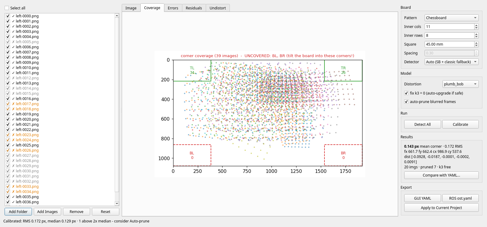
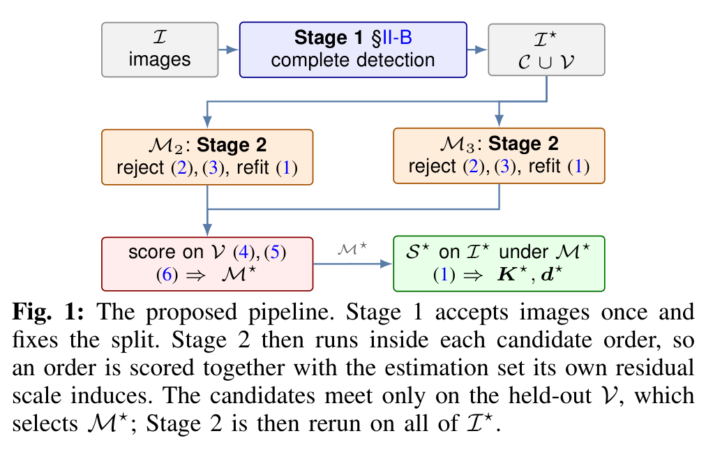
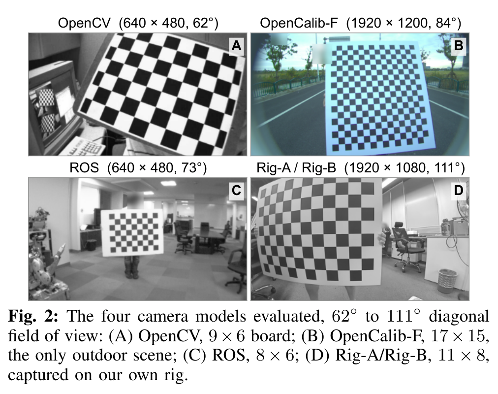
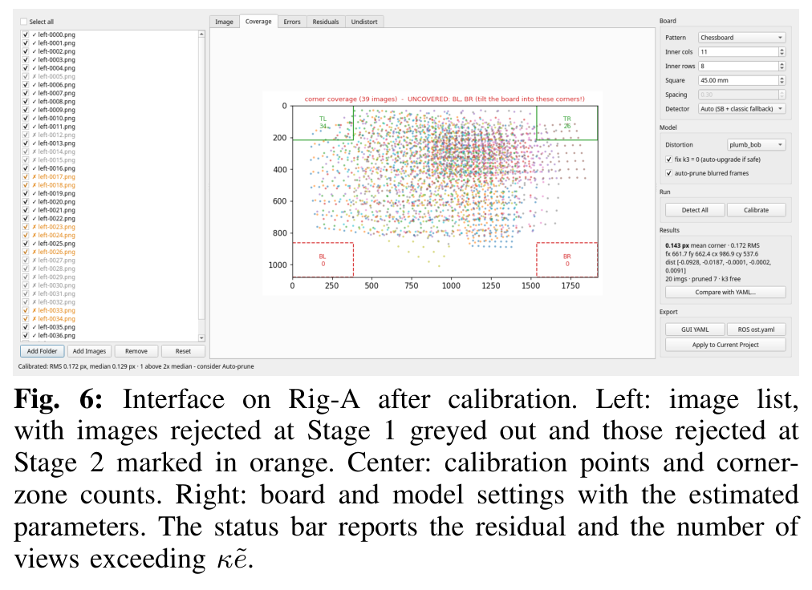
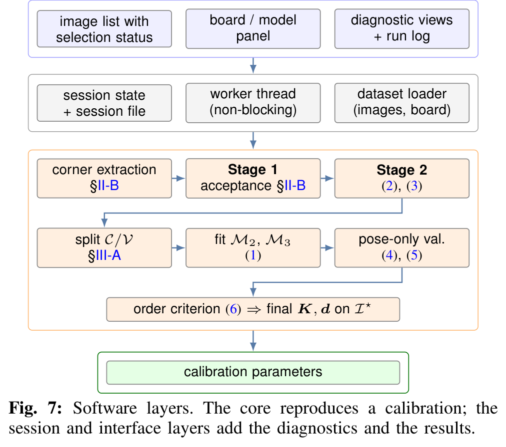
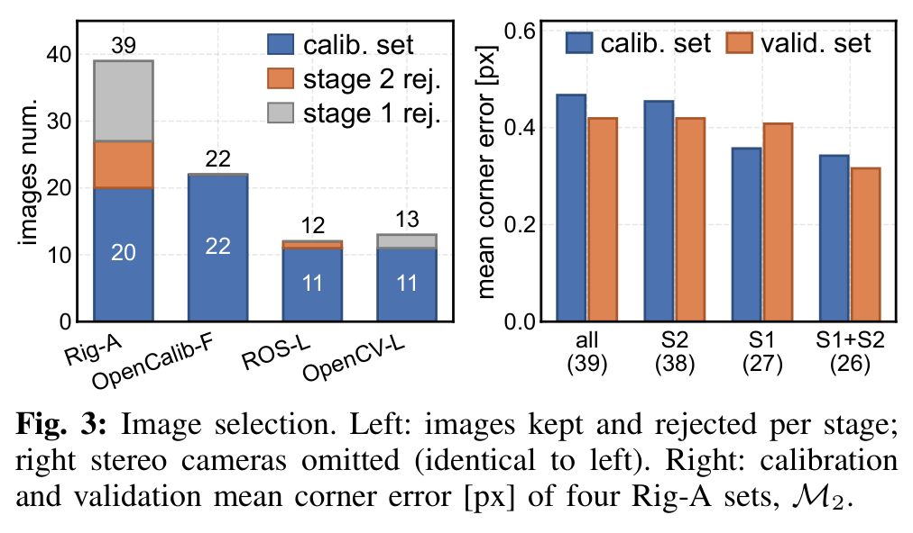
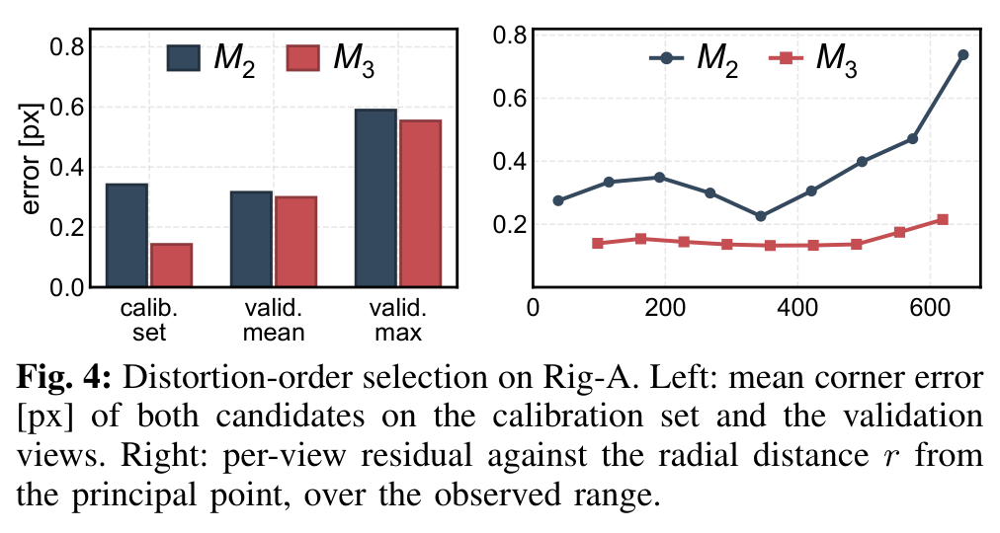
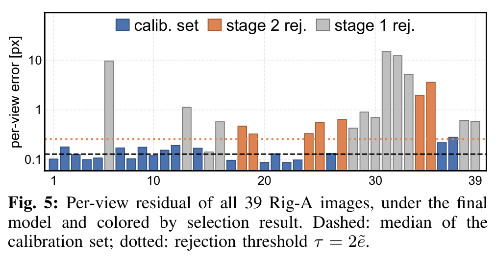
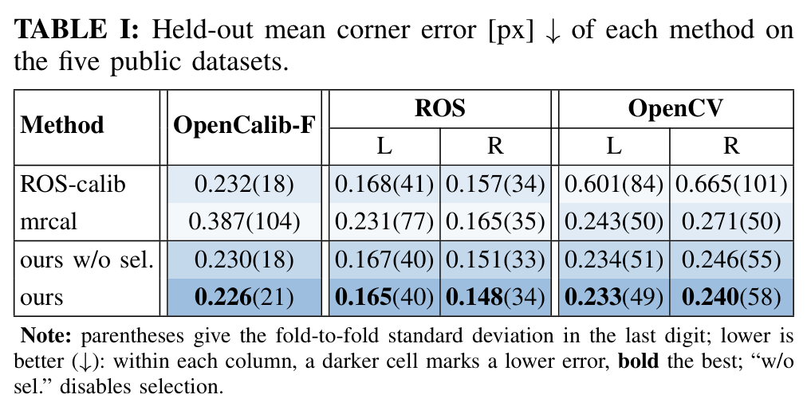

<div align="center">

<h1>Automatic Reproducible Camera Intrinsic Calibration</h1>

<p><a href="https://github.com/JokerJohn"><b>Xiangcheng Hu</b></a></p>



<a href="https://arxiv.org/abs/2609.10082"></a><a></a>[](https://github.com/JokerJohn/IntrinsicCalib/stargazers)<a href="https://github.com/JokerJohn/IntrinsicCalib/network/members"></a>[](https://github.com/JokerJohn/IntrinsicCalib/issues)[](https://opensource.org/licenses/MIT)

</div>

## Introduction

The goal here is high-precision intrinsic calibration that nobody has to babysit: a mean reprojection error below **0.2 pixel**, reached without anyone hand-picking images or guessing a distortion model.

Camera intrinsics are calibrated once and then used everywhere, so an error made here shows up in every downstream task. How good they are depends on which images you calibrate from and which distortion model you pick — and today both are usually left to the person running the tool. This work decides both from the data:

- **Image selection.** Views whose residual is more than twice the median get dropped, and the rejection is repeated inside each candidate distortion order, so the kept images match that order's own residual scale.
- **Distortion-order selection.** Each order is scored on held-out images with the intrinsics and distortion frozen and only the board pose refitted, so an extra coefficient has to earn its place on data it never saw.
- **Interactive tool.** Both steps run inside a calibration tool that shows what was kept, what was dropped, and why.

On our own camera data and five public datasets, image filtering cuts the held-out reprojection error by 25% and order selection by another 5% — the lowest held-out mean of the four configurations compared. On our own rig this lands at 0.143 px on the retained images, against 0.151 px for mrcal and 0.299 px for the ROS calibrator; held-out error goes down to 0.148 px on the public sets.

<div align="center">



</div>

## News

- **2026/09/09**: [arXiv preprint](https://arxiv.org/abs/2609.10082) online; code, tool and data are being prepared for release.

## Cameras and Datasets

<div align="center">



</div>

<div align="center">

| Dataset | Camera | Images | Board |
| ------- | ------ | -----: | ----- |
| `Rig-A` | 1920×1080, 111° | 39 | 11×8, 45 mm |
| `Rig-B` | same rig, 2 sessions | — | 11×8, 45 mm |
| `OpenCalib-F` | 1920×1200, 84° | 22 | 17×15, 50 mm |
| `ROS L/R` | 640×480, 73° | 12 | 8×6, 108 mm |
| `OpenCV L/R` | 640×480, 62° | 13 | 9×6, 30 mm |

</div>

`Rig-A` and `Rig-B` are our own hand-held captures; the rest come from [OpenCalib](https://github.com/PJLab-ADG/SensorsCalibration), ROS and OpenCV. Download links will be added on release.

## Interactive Calibration Tool

<div align="center">



</div>

You point it at an image folder, type in the board geometry, and hit calibrate. Every decision the pipeline makes is visible and written out with the result: which images were kept or dropped at each stage and their residuals, the validation split, the four numbers behind the order choice, and how many corners landed in each part of the image. The core runs headless too — every number in the paper came from a script.

<div align="center">



</div>

## Method

Calibration itself is the usual thing: fit intrinsics `K`, distortion `d` and one board pose per image by minimising reprojection error over an image set `S`.

<div align="center">

$$
\min_{K,\,d,\,\{T_i\}} \sum_{i \in \mathcal{S}} \sum_{j=1}^{N_i} \left\| u_{ij} - \pi(K, d, T_i, P_j) \right\|_2^2
$$

</div>

**Image selection.** After a first fit, each view has a mean residual. Anything above twice the median of the set gets thrown out, then the fit is redone — and because the median is recomputed each round, the bar tightens as the bad views leave:

<div align="center">

$$
\tau^{(t)} = \kappa\,\tilde{e}^{(t)}, \quad \kappa = 2, \qquad
\mathcal{I}^{(t+1)} = \left\lbrace\, i \in \mathcal{I}^{(t)} \;\middle|\; \bar{e}_i^{(t)} \le \tau^{(t)} \,\right\rbrace
$$

</div>

> The catch is that this bar depends on the distortion order: a higher order fits the same corners more closely, so its residuals are smaller and a set fixed in advance suits neither order. That's why the rejection runs separately inside each candidate.

**Distortion-order selection.** Every fifth image is held out. For those views the intrinsics and distortion stay frozen and only the 6-DoF board pose is refitted, so the score never touches data that shaped the fit:

<div align="center">

$$
\hat{T}_i^{\mathcal{M}} = \arg\min_{T \in \mathrm{SE}(3)} \sum_{j=1}^{N_i} \left\| u_{ij} - \pi(K_{\mathcal{M}}, d_{\mathcal{M}}, T, P_j) \right\|_2^2
$$

</div>

The extra radial coefficient $k_3$ is adopted only if it makes neither the average nor the worst held-out view worse:

<div align="center">

$$
\bar{e}_{\mathrm{v}}(\mathcal{M}_3) \le \alpha\,\bar{e}_{\mathrm{v}}(\mathcal{M}_2)
\quad\text{and}\quad
e^{\max}_{\mathrm{v}}(\mathcal{M}_3) \le \beta\,e^{\max}_{\mathrm{v}}(\mathcal{M}_2)
$$

</div>

## Results

|  |  |
| ------------------------------------ | ---------------------------- |
|  |  |

## Getting Started

> The tool isn't released yet — the steps below show what running it will look like.

Python, for Ubuntu 20.04/22.04 with OpenCV and PySide6.

```bash
git clone https://github.com/JokerJohn/IntrinsicCalib.git
cd IntrinsicCalib
scripts/setup_env.sh          # conda environment
scripts/run_gui.sh            # launch the tool
```

Point it at a folder of chessboard images, set the board geometry, then `Detect All` and `Calibrate`. Both stages can be switched off to reproduce the ablations above.

## TODO

- [ ] Release the calibration tool and the evaluation scripts
- [ ] Release the Rig-A and Rig-B image sets
- [ ] Add rational and fisheye models to the candidate set
- [ ] Fold corner-coverage constraints into the filtering criterion

## Citation

```bibtex
@article{hu2026intrinsiccalib,
  title   = {Automatic Reproducible Camera Intrinsic Calibration},
  author  = {Hu, Xiangcheng},
  journal = {arXiv preprint arXiv:2609.10082},
  eprint  = {2609.10082},
  year    = {2026}
}
```

## License

Released under the [MIT license](./LICENSE).

## Acknowledgment

Thanks to [OpenCalib](https://github.com/PJLab-ADG/SensorsCalibration), [ROS camera_calibration](http://wiki.ros.org/camera_calibration), [OpenCV](https://github.com/opencv/opencv) and [mrcal](https://mrcal.secretsauce.net) for the public data and the baselines this work is measured against.

## Contributors

<a href="https://github.com/JokerJohn/IntrinsicCalib/graphs/contributors">
  
</a>
